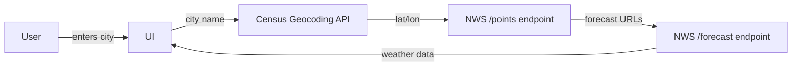

# Design Document

## Overview

A single-page HTML/CSS/JavaScript weather app with no build tooling or frameworks. The app runs entirely in the browser, making direct API calls to two public US government services:

- **US Census Bureau Geocoding API** — converts a city name to lat/lon coordinates
- **National Weather Service API (api.weather.gov)** — provides current conditions and forecast

No API keys are required for either service.

## Architecture



The flow is:
1. User enters a city name and submits.
2. App calls Census Geocoding API to get lat/lon.
3. App calls `https://api.weather.gov/points/{lat},{lon}` to get the NWS grid metadata, which includes URLs for the hourly and daily forecast endpoints.
4. App calls the NWS daily forecast endpoint to get current conditions + 5-day forecast periods.
5. UI renders the results.

## Components and Interfaces

### Files

```
weather-app/
  index.html   — markup, layout, and inline styles
  app.js       — all API calls and DOM manipulation
```

### app.js Modules (functions)

- `geocodeCity(cityName)` — calls Census API, returns `{ lat, lon, city, state }`
- `getNWSPoints(lat, lon)` — calls NWS `/points`, returns forecast URL
- `getForecast(forecastUrl)` — calls NWS forecast endpoint, returns array of periods
- `renderCurrent(period, locationInfo)` — updates the current conditions section of the DOM
- `renderForecast(periods)` — builds and inserts the 5-day forecast table
- `setLoading(bool)` — shows/hides loading spinner
- `showError(message)` — displays error message in the UI

### API Details

**Census Geocoding API**
```
GET https://geocoding.geo.census.gov/geocoder/locations/onelineaddress
  ?address={city}
  &benchmark=Public_AR_Current
  &format=json
```
Returns coordinates from the first match.

**NWS Points**
```
GET https://api.weather.gov/points/{lat},{lon}
```
Returns `properties.forecast` (daily) and `properties.forecastHourly` URLs.

**NWS Forecast**
```
GET {properties.forecast}
```
Returns `properties.periods[]` — each period has:
- `name` (e.g., "Monday", "Monday Night")
- `temperature`, `temperatureUnit`
- `shortForecast`
- `detailedForecast`
- `windSpeed`, `windDirection`
- `relativeHumidity.value`
- `icon` (URL to NWS condition icon)

## Data Models

```js
// Location resolved from Census API
{ lat: number, lon: number, city: string, state: string }

// NWS forecast period (subset used)
{
  name: string,
  temperature: number,
  temperatureUnit: string,
  shortForecast: string,
  windSpeed: string,
  windDirection: string,
  relativeHumidity: { value: number },
  icon: string,
  isDaytime: boolean
}
```

## Weather Condition Graphics

NWS provides icon URLs directly in each forecast period (`period.icon`). These will be used as `` tags. No external icon library is needed.

For the current conditions section, the icon will be displayed prominently (64x64px). In the forecast table, a smaller version (32x32px) will be shown per row.

## UI Layout

```
┌─────────────────────────────────┐
│         Weather App             │
│  [City input]  [Search button]  │
│                                 │
│  Current Conditions             │
│  [Icon] City, ST                │
│         72°F  Partly Cloudy     │
│         Humidity: 55%           │
│         Wind: SW 10 mph         │
│                                 │
│  5-Day Forecast                 │
│  ┌──────┬──────┬──────┬──────┐  │
│  │ Day  │ Icon │ High │ Cond │  │
│  ├──────┼──────┼──────┼──────┤  │
│  │ Mon  │  ☀️  │ 75°F │ Sunny│  │
│  │ Tue  │  🌧  │ 62°F │ Rain │  │
│  └──────┴──────┴──────┴──────┘  │
└─────────────────────────────────┘
```

## Error Handling

| Scenario | Behavior |
|---|---|
| Empty input | Show inline message: "Please enter a city name." |
| City not found (Census) | Show: "City not found. Try including the state, e.g. 'Austin, TX'." |
| NWS points error | Show: "Weather data unavailable for this location." |
| Network failure | Show: "Network error. Please check your connection and try again." |
| Any error | Retry button re-runs the last search |

## Testing Strategy

- Manual browser testing after each task (open `index.html` directly in browser — no server needed).
- Test with a variety of cities: large cities, small towns, cities with common names in multiple states.
- Test error states by temporarily using invalid coordinates or disconnecting network.
- Verify responsive layout by resizing the browser window.
